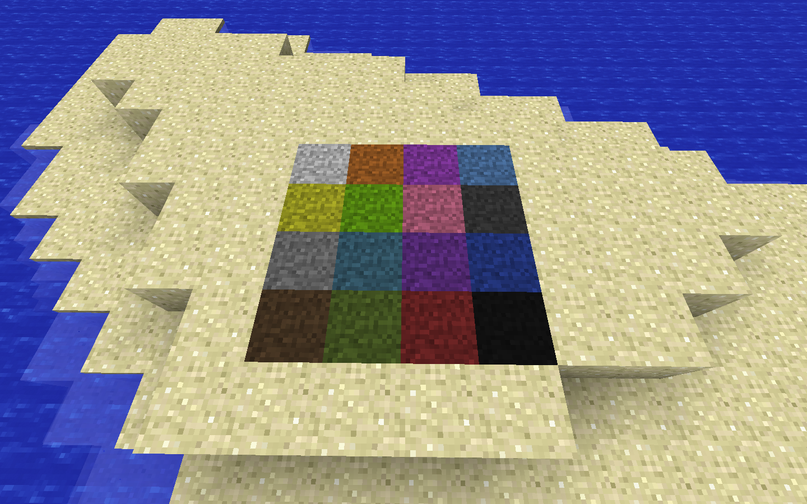
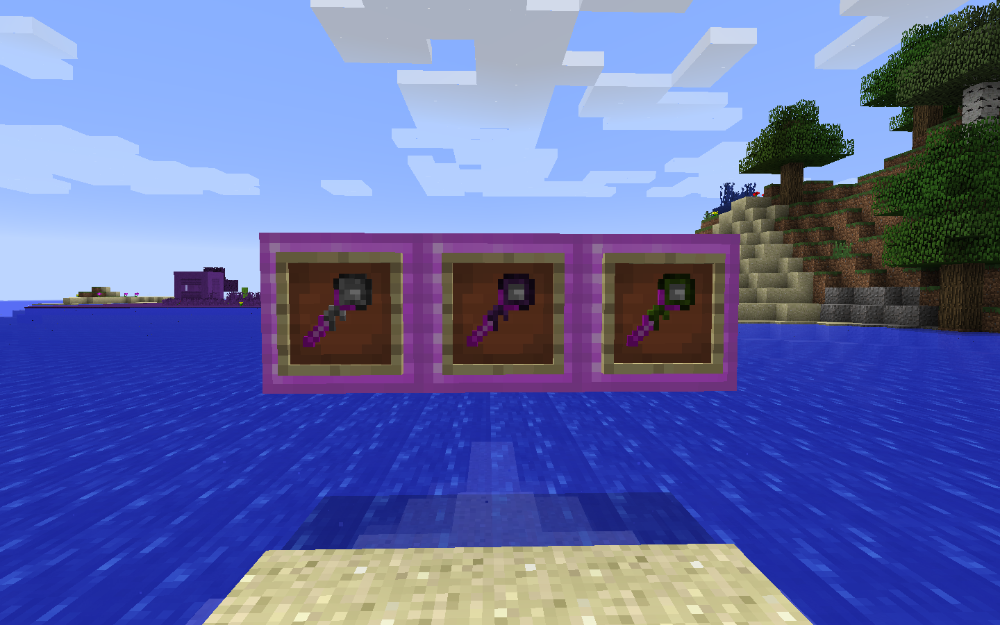
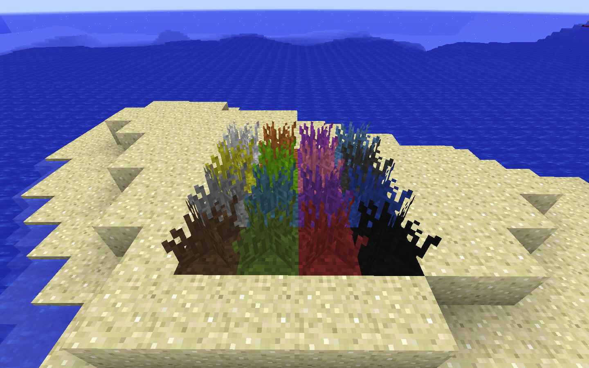
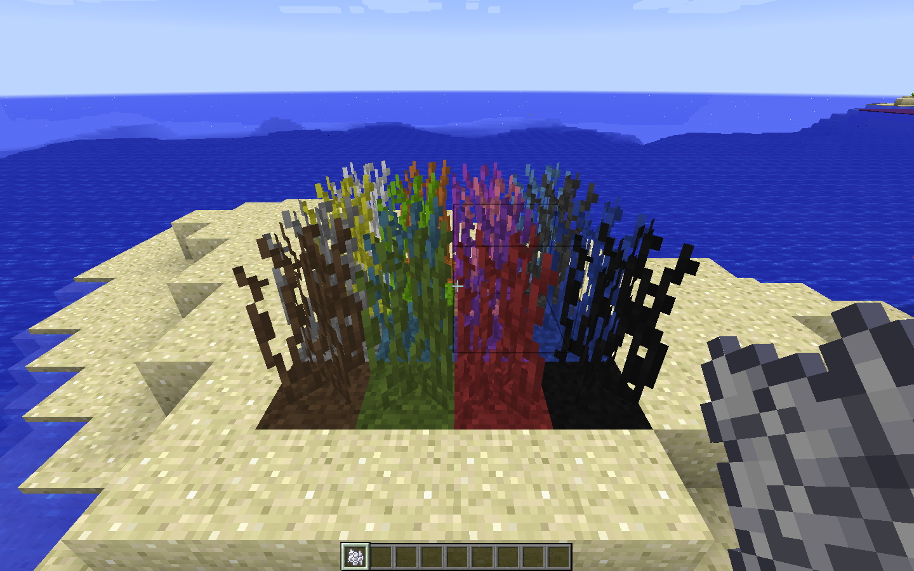
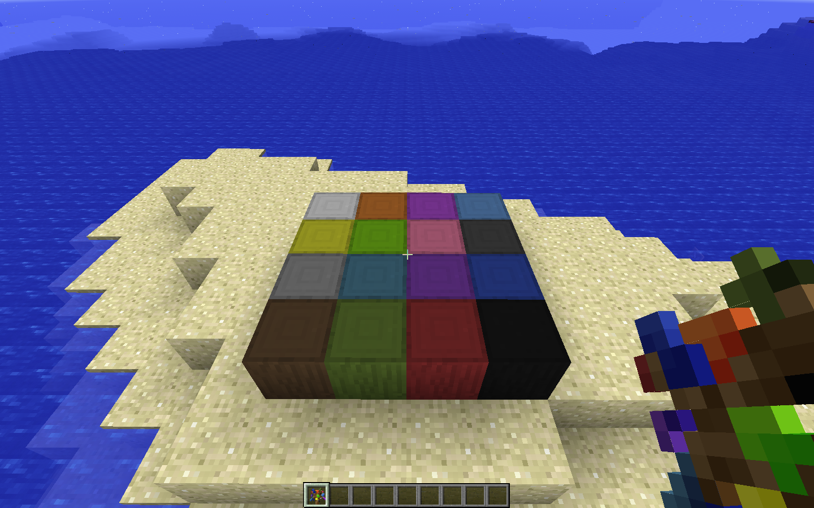
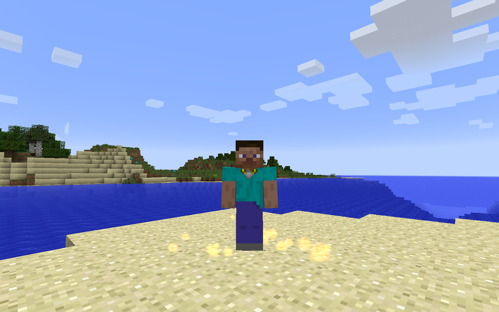
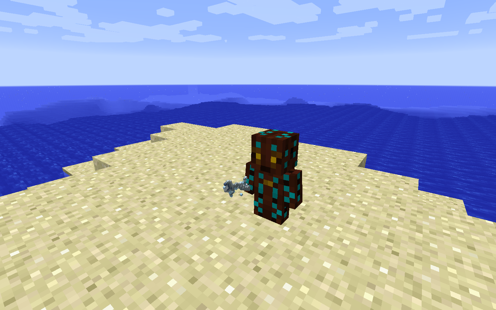
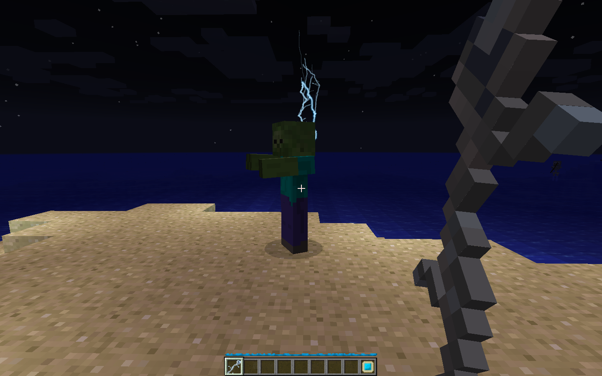
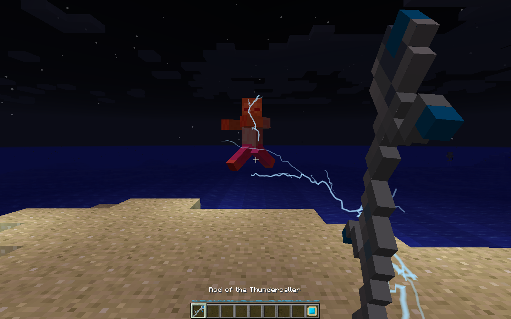
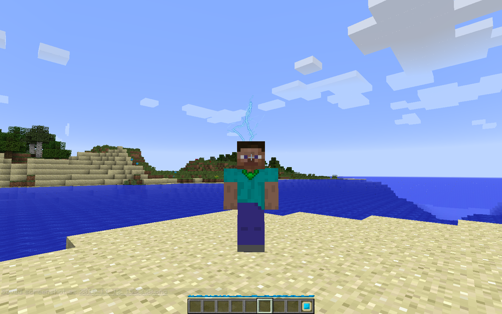

# Botanical Addons

In mystical flowers, lies the essence of color. This essence, when extracted, has another name.
## Iridescence

The power of Heimdall, lord of the Bifrost, is manifest in Iridescence. This essence can be infused into various mundane materials, making them into a spectacle to behold.  

This can be created either by crafting, or by the Rod of the Iridescence.  

Grass and trees can be grown upon this dirt, as well as any mundane variety of crop that can survive on Farmland.  

Using the Priestly Emblem: Sif, you bind yourself to the goddess of Earth. By this, your range for using the Rod of the Iridescence extends to the fullest of your reach.  

## Thunder

The power of Thor, god of Thunder, is manifest in Ender Air. You can call it forth with the Rod of the Thundercaller.  

Charge up...  

And watch it wreak havoc!  

Using Manatide Prowess and the Ring of Thor will increase the power of the rod. To more potently increase it, you can use the Priestly Emblem: Thor.

Requires:
* Botania - 236

Botanical Add-ons by L0neKitsune and Wire Segal is licensed under the [Botania License](http://botaniamod.net/license.php)
